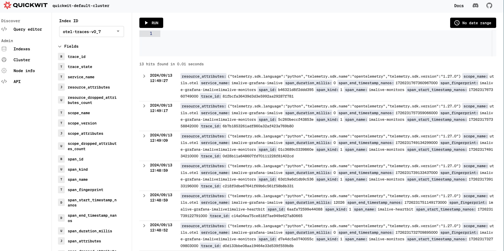
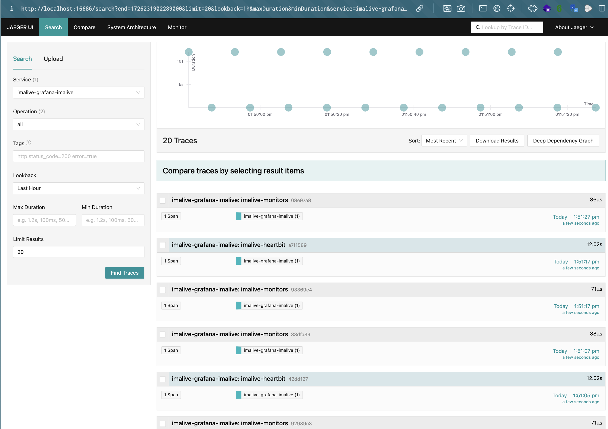

# Demo using kubernetes

It's a multitenant demo (each tenant is a namespace of Kubernetes)

## Requirements

* Python 3
* helm 3.14+
* kubectl v1.27.3+
* Rancher desktop or docker desktop on Windows or Mac, docker CE on Linux
* Kind

## Installation of a tenant

```shell
python3 tenant.py --name test --kind --install
```

If your `kind` cluster or any kubernetes cluster is configured, you can remove the `--kind` flag.

## Test quickwit

```shell
python3 tenant.py --name test --tunnel quickwit
```

Quickwit will be available here: http://localhost:7280 

You'll find OTEL traces here:



## Test Jaegger UI

```shell
python3 tenant.py --name test --tunnel jaeger
```

Jaeger UI will be available here: http://localhost:16686

You'll find OTEL traces here:



## Test Grafana

```shell
python3 tenant.py --name test --password --tunnel grafana
```

Grafana will be available here: http://localhost:8081

Generated password will be printed.

The quickwit's plugin will be available

## Hands-on

You can also add this [mapping](./mapping_metrics.json) like this:

```shell
curl -X POST localhost:7280/api/v1/indexes -H "Content-Type: application/json" -H "Accept: application/json" -d '@mapping_metrics.json' -v
```

Then try to push imalive metrics into this new index through a new vector pipeline.

### Solution

|
|
|
|
|
|
|
|
|
|
|
|
|
|
|
|
|
|
|
|
|
|
|
|
V

The remap function:

```yaml
remap_metrics:
  inputs:
    - "kubernetes_logs"
  type: "remap"
  source: |
    .time, _ = to_unix_timestamp(.timestamp, unit: "nanoseconds")
    .message = string!(.message)
    .message = replace(.message, r'^[^:]*:[^:]*:', "")
    log("message to parse: " + .message, level: "info")
    .body, err = parse_json(.message)
    if err != null || is_null(.body) || is_null(.body.cpu) || is_null(.body.virtual_memory) {
      abort
    }

    .cpu = .body.cpu.percent.all
    .disk = .body.disk_usage.percent
    .ram = .body.virtual_memory.percent

    del(.body)
    del(.message)
    del(.timestamp)
    del(.source_type)
    del(.container_name)
```

And the sinks:

```yaml
quickwit_metrics:
  type: "http"
  method: "post"
  inputs: ["remap_metrics"]
  encoding:
    codec: "json"
  framing:
    method: "newline_delimited"
  uri: "http://quickwit-indexer.{{ tenant_name }}.svc.cluster.local:7280/api/v1/my-metrics/ingest"
```
