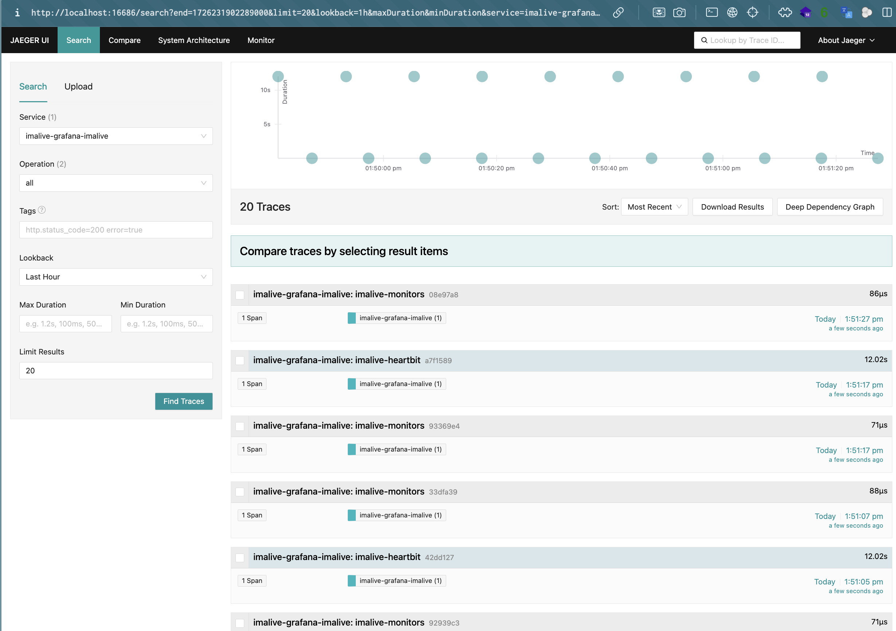

# Demo using docker docker

```shel
cd demo/docker
docker compose up --force-recreate
```

## Test quickwit

Quickwit will be available here: http://localhost:7280 

You'll find OTEL traces here:


## Test Jaegger UI

Jaeger UI will be available here: http://localhost:16686

You'll find OTEL traces here:



## Test Grafana

Grafana will be available here: http://localhost:3000

Default credentials is `admin` / `admin`

The quickwit's plugin will be available
